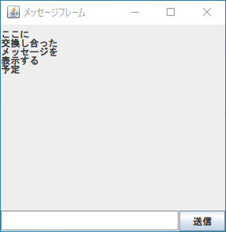

# 課題01

メッセージアプリのベースとなるアプリを作る

## 問題

アプリのベース（以降、メインフレームと呼ぶ）の実装を行ってください。

メインフレームを扱うクラスは swing の JFrame を継承して実装を行ってください。その他の好きなJavaのUIフレームワークを使ってもかまいません。

フレームや各要素の大きさは自由に設定してくれていいですが、見やすい大きさになるようにレイアウトを工夫してください。

必須要件として、次の3つの要素を含むようにしてください。ただし、機能ごとに適切に階層化を行ってください。箇条書きの階層化はそのままヒントになっています。実際の機能は課題02で実装します。

- やりとりしたメッセージを表示する JPanel
    - 交換したテキストを表示する（0個以上の） JLabel 
- メッセージを送るための送信部を司る JPanel
    - メッセージの入力を行う JTextField
    - メッセージの送信を行う JButton

さらに、ダミーのメッセージをいくつか入れてみてください。実行結果は以下のようになります。例では5つのメッセージを送りあったようなダミーデータを使用しています。

