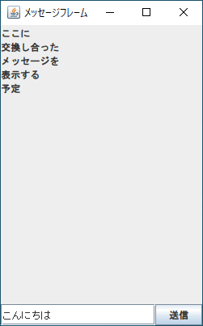
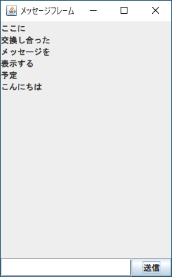

# 課題02

入力欄と送信ボタンを実装する

## 問題

入力したメッセージが、メッセージの履歴に追加されるようにしてください。

具体的な方針として、送信ボタンをクリックしたときに入力欄の文字列を取得してメッセージを追加するようにしてください。メッセージを追加してもう反映されないときは `repaint` や `revalidate` を使用してください。

実行結果は以下のようになります

