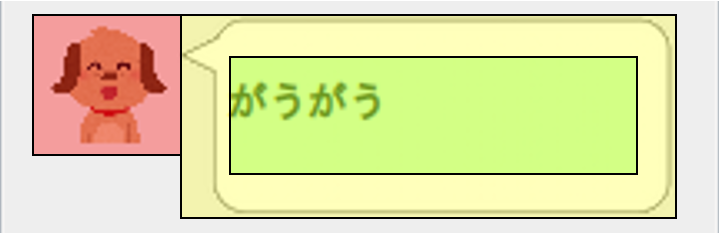
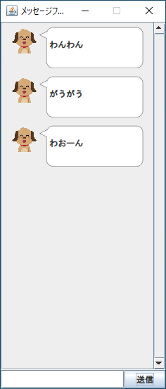

# 課題03

アイコン付き吹き出しメッセージを作る

## 問題

メッセージを吹き出しのイラストで飾り付けます。また、ユーザに紐づくアイコンも表示してみましょう。

吹き出しとアイコンに使う画像を作成します。筆者は、吹き出し画像をパワーポイントで作り、アイコンはいらすとやで「イヌ」と検索してダウンロードしました。

メッセージの吹き出しは JPanel を継承した MessagePanel で扱うことにしました。レイアウトは、座標を扱えるようなものを使ってください。
「アイコン」「吹き出し」「文字」を次の図のように並べて表示しました。
画像は `swing` フレームワークの `ImageIcon` を使用しました。

課題02までで作ったアプリのメッセージを、 MessagePanel で置き換えると次のようになります。

