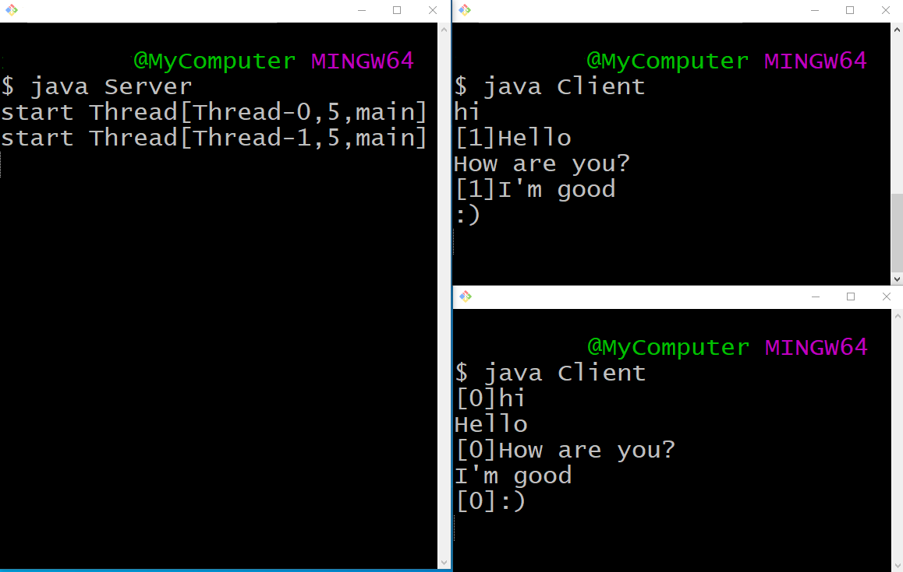

# 課題05

サーバクライアント間のメッセージの送受信を実装する

## 問題

サーバ-クライアント間でsocket通信を行う、サーバとクライアントのそれぞれの実装をコードリーディングしましょう。
動作についは下で解説を行っています。ここではコーディングしてもらうことはないですが、しっかりと理解してみましょう。

### サーバ側

#### ソースコード

```java
import java.io.*;
import java.net.*;
import java.util.*;


class Server {
    public static final int PORT = 10001;

    private class Connection implements Runnable {
        public final int id;
    
        private Socket socket;
        private PrintWriter out;
        private BufferedReader in;
        private Server server;

        private Connection(int id, Socket socket, Server server) {
            this.id = id;
            this.server = server;
            this.socket = socket;
            try {
                this.out = new PrintWriter(this.socket.getOutputStream(), true);
                this.in = new BufferedReader(new InputStreamReader(this.socket.getInputStream()));
            } catch (IOException e) {
                System.err.println(e);
            }
        }
    
        @Override
        public void run() {
            System.out.println("start " + Thread.currentThread());
            try {
                String text = null;
                while((text = this.in.readLine()) != null) {
                    String sendingText = "[" + this.id + "]" + text;
                    this.server.send(this.id, sendingText);
                }
                this.server.remove(this.id);
                this.socket.close();
            } catch (IOException e) {
                System.out.println(e);
                this.server.remove(this.id);
            }
        }

        public void send(String text){
            this.out.println(text);
        }
    }

    private List<Connection> connections;

    private Server() {
        this.connections = new LinkedList<>();
        int count = 0;

        try (ServerSocket serverSocket = new ServerSocket(PORT)) {
            while (true) {
                Socket socket = serverSocket.accept();
                Connection c = new Connection(count++, socket, this);
                this.connections.add(c);
                new Thread(c).start();
            }
        } catch (IOException e) {
            System.out.println(e);
        }
    }

    private synchronized void send(int senderId, String text){
        for (Connection c : this.connections) {
            if (c.id != senderId) {
                c.send(text);
            }
        }
    }

    private synchronized void remove(int id) {
        this.connections.removeIf(c -> c.id == id);
        send(id, "quiting [" + id + "]");
    }

    public static void main(String args[]) throws IOException {
        new Server();
    }
}
```

### クライアント側

#### ソースコード

```java
import java.io.*;
import java.net.*;

class Client {
    private static final int PORT = 10001;
    private static final String HOST = "localhost";

    private class Connection implements Runnable {
        BufferedReader in;
        PrintWriter out;

        private Connection(InputStream in, OutputStream out) {
            this.in = new BufferedReader(new InputStreamReader(in));
            this.out = new PrintWriter(out, true);
        }

        public void run() {
            try {
                String s;
                while((s = this.in.readLine()) != null) {
                    this.out.println(s);
                }
            }
            catch(Exception e) {
                System.err.println("sender error");
                System.err.println(e);
            }
        }
    }

    public Client() {
        try (Socket socket = new Socket(HOST,PORT)) {
            // 自分が書いたテキストをサーバに送るスレッド
            InputStream inToServer = System.in;
            OutputStream outToServer = socket.getOutputStream();
            Thread thToServer = new Thread(new Connection(inToServer, outToServer));

            // サーバから送られたテキストを扱うスレッド
            InputStream inFromServer = socket.getInputStream();
            OutputStream outFromServer = System.out;
            Thread thFromServer = new Thread(new Connection(inFromServer, outFromServer));

            thToServer.start();
            thFromServer.start();

            while (true);

        } catch (IOException e) {
            System.err.println("client error");
            System.err.println(e);
        }
    }

    public static void main(String args[]) {
        new Client();
    }
}
```

### 実行

ターミナルを3つ以上立ち上げます。
一つで、`java Server` を実行してから、残りで `java Client` を実行します。
あるクライアントで入力した内容が、ほかのクライアントに表示されれば成功です。



### 解説

プログラミング演習の課題なので詳しい通信についての解説は行いませんが、興味があれば調べてみましょう。

#### サーバ側

`Server` クラスのコンストラクタ内で `ServerSocket` が生成されています。
コンストラクタ生成時に、ソケットの作成とIPアドレスとポートの紐づけを行っています。
`serverSocket.accept()` で、ソケットの接続があるまで待機し、接続されたソケットをもとに、 `Connection` オブジェクトの生成を行います。

`Connection` オブジェクトはソケットから送られるデータを監視し(`this.in.readLine()`)、データが送られると、 `Server` に「自分を除く全員」に送信させます（`this.server.send(this.id, sendingText);`）。

`Server` クラスの `send` `remove` は、非同期処理でも順番が前後してはいけない情報を扱うので、 `synchronized` を付けています。

#### クライアント側

`Client` クラスは、アドレス `localhost` 、ポート `10001` （サーバで指定したポートと同一）に接続を試みます。

`Client` クラスは「ユーザからサーバに送るメッセージ」と「サーバからユーザに送るメッセージ」間の2種類の入出力を扱う必要があります。これらはともに、「一方から受け取った情報をそのまま他方に流す」という共通の動作をしていることがわかります。この共通部分は `Connection` クラスに任せています。サーバ側の `Connection` クラスとは同名ですが別物であることに注意してください。

`Connection` のコンストラクタを見ると、 `InputStream` と `OutputStream` を受け取っています。また `run` の実装を見ると、　`InputStream` で受け取った情報が `OutputStream` にそのまま流されていることがわかります。（`BufferedReader` や `PrintWriter` を使ってますが、情報源はコンストラクタに渡したストリームです）

「ユーザからサーバに送るメッセージ」は、ターミナルに打ったテキストがソケット通信で送られるようにしたいので、`InputStream` を `System.in` 、 `OutputStream` を `socket.getOutputStream()` としています。「サーバからユーザに送るメッセージ」は、ソケット通信で送られた情報をターミナルに表示するので、 `InputStream` を `socket.getInputStream()` 、 `OutputStream` を `System.out` としました。
