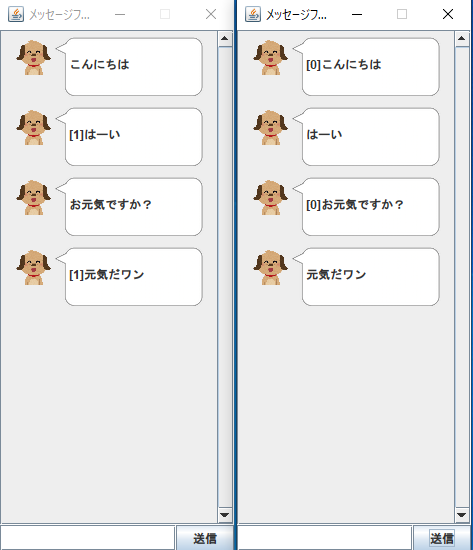

# 課題06

アプリとクライアントの連携を実装する

## 問題

アプリとクライアントを連携して、アプリで送信したデータを他方のアプリで受信できるようにしましょう。いくつか実装方法が考えられますが、ここではその一つを紹介します。動作が確認できればこの方針に従うかどうかは自由です。

`Client` の具体的な実態はまだ分かりませんが、`Server` と通信するための `Client` オブジェクトをアプリのフィールドに持たせます。 `Client` がどのような処理ができると嬉しいか考えてみましょう。
現状のアプリでは、

- 送信ボタンを押したときに `addMessage(text)` が実行される

という処理のみが行われています。

- 送信ボタンを押したときには `sendToServer(text)` を実行して送信したい
- メッセージを受け取ったときには `addMessage(text)` を実行したい

という気持ちになります。 `sendToServer` メソッドの具体的な役割、 メッセージを受け取る方法について考えればいいことが分かりました。

### sendToServer メソッドの実装

`sendToServer` は「文字列をサーバに送る」という処理をしたいです。サーバとの通信の情報は `Client` オブジェクトが持っているので、具体的な処理は `client.send(text)` のようなメソッドに任せればよいです。
こうすることで、アプリはサーバの情報を知ることなく送信が行えました。仮にサーバとの通信方法が変わっても、アプリに変更を加えずに `Client` クラスのみ修正するだけですみそうです。このように役割ごとに機能を切り分けることで「疎結合」になり、保守性が上がります。

では、 `Client` クラスに `send` メソッドを追加して実装してみましょう。
課題05で作成したプログラムで、 `socket.getOutputStream()` を元に生成した `PrintWriter` を使ってサーバに送信していました。 `send` メソッドでこれを呼び出せばよいです。
`Client` は `PrintWriter` をフィールドに持っておくといいこともわかりますね。
また、 `Client` からメッセージを送るのは送信ボタンを押したなので、送信待ちの `while((text = this.in.readLine()) != null)` ももはや必要なくなります。

### メッセージを受け取ったときの処理の実装

課題05で作成したプログラムでは、 `Client` の中で `while((text = this.in.readLine()) != null)` を使ってメッセージを受け取っていました。今回もこのアイディアを採用したいです。
課題05のプログラムでは、受け取ったメッセージを `out.println` で出力していました。今回はこの出力先をアプリにしたいです。そこで、こんなインターフェースを用意してみます。

```java
public interface MessageReceiver {
    public void received(String text);
}
```

`MessageReceiver` は「メッセージを受け取る」という処理をします。これだけだとなんのこっちゃですが、このインターフェースは非常に有効です。 `Client` クラスのフィールドに `MessageReceiver` オブジェクトを追加して、コンストラクタで初期化してください。あとは、`while((text = this.in.readLine()) != null)` の中で受け取った文字列を `received(text)`として送信すれば `Client` 側の処理は終わりです。 `Client` は、受け取った文字列を受け取ることが仕事なので、受け取ったあとの処理をしなくていいですし、しない方がいいです。

アプリのクラスで `MessageReceiver` インターフェースを実装してください。こうすれば、アプリそのものが `MessageReceiver` になることがわかります。 `Client` オブジェクトの生成時に自分自身（すなわち `this` ）を渡せば、 `Client` の `MessageReceiver` フィールドとして扱うことができるようになります。 `received` メソッドをオーバーライドするときに当初の目的だった `addMessage` メソッドを呼び出せば、メッセージの受け取りも完了です。

なぜ `MessageReceiver` インターフェースを作成する必要があったのでしょうか。 `Client` クラスにアプリのクラスそのものを渡しても問題なく動作します。
`Client` クラスは `received` メソッドを呼び出すだけなので、アプリの他の機能は用がないです。それでもアプリの機能全てを渡されてしまうと、ついうっかり使ってしまうことがあるかもしれません。これは予想外の挙動、バグを産む可能性があります。
また、 `MessageReceiver` を実装していれば誰でも受け付けられるので、他のアプリを実装するときに `Client` クラスの変更が少なくて済みます。
これらはすべて「疎結合」にするためのモチベーションになります。

### Connection クラスの扱い

課題05で「共通部分を `Connection` クラスに任せる」という説明をしました。今は送信と受信で大きく処理が異なるので、 `Connection` クラスは廃止して個別に実装するとよいでしょう。
`Connection` を廃止しないのなら、送受信それぞれでの処理を記述した `SendConnection` と `ReceiveConnection` のように実装してもいいです。

### 実行

ターミナルを3つ以上立ち上げます。
一つで、`java Server` を実行してから、残りでアプリを実行します。
あるアプリで入力した内容が、ほかのアプリに表示されれば成功です。



自分が送った文字列以外には余分な情報がついていて誰から送られたかも判別しにくいですが、これは次の課題で解決します。
